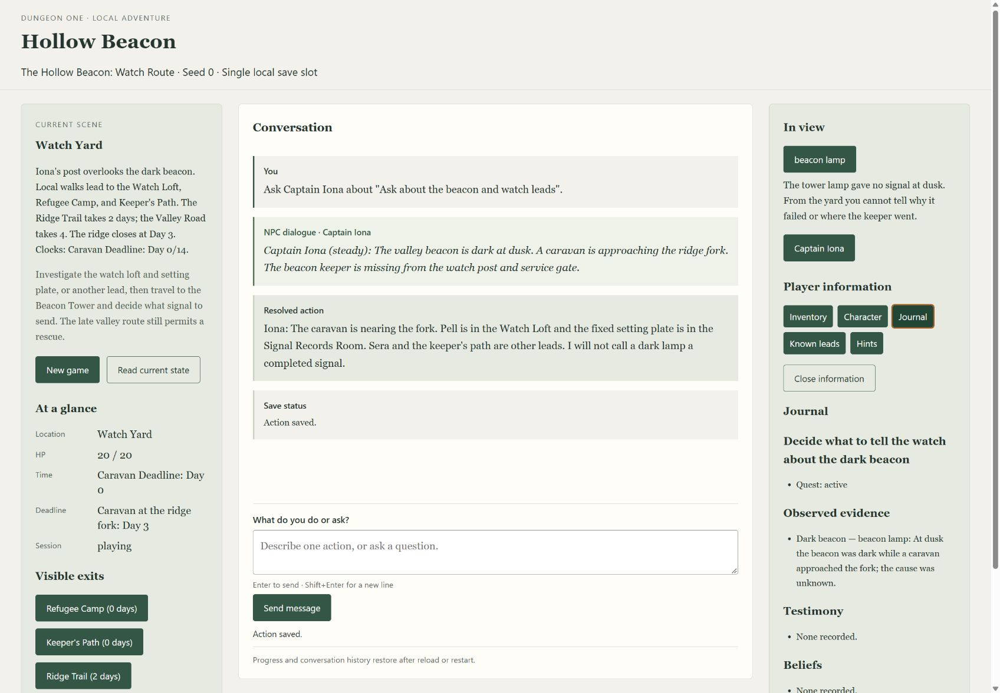

# Issue 106: increment 9 qualification and increment 8 handoff

Qualification on 1 October 2026 targets the delivered **Hollow Beacon: Watch
Route**, content version 4 through issue #84. Issues #104 and #105 are closed.
This ticket does not author a new finale, change other adventures, rewrite or
close remaining increment 8 tickets, or claim unfamiliar-player acceptance.

## Reproduce the delivered game

Prerequisites: Node 24.x (the project pins 24.21.0), npm 11.6.4, a desktop
browser, dependency registry access for installation, and a valid
`OPENAI_API_KEY` in the launcher environment with provider network access.
The key is not a game command and must not be put in a save or evidence file.
From a checkout at `C:\docs\git\dungeonOne`:

```powershell
Set-Location C:\docs\git\dungeonOne
npm.cmd ci --cache .\.verify-artifacts\npm-cache
npm.cmd run build
New-Item -ItemType Directory -Force .\.scratch\issue-106-player | Out-Null
npm.cmd run browser -- --seed 0 --save .\.scratch\issue-106-player\slot.json
```

Use an empty slot directory for the first run. The launcher prints
`Hollow Beacon: http://127.0.0.1:<available-port>` and attempts to open that
URL. Keep it running; ports are assigned by the OS and can change on restart.
Select **Start adventure**: Watch Yard, seed 0, Day 0, Day 3 caravan deadline,
20/20 HP and an empty conversation appear. The opening saves automatically.

Perform these browser actions separately, waiting for each complete reply and
enabled message input:

1. Select **Captain Iona**, then **Ask about the beacon and watch leads**.
   Expect an attributed NPC reply, engine result card, saved notice, and a
   journal lead to Pell and the setting plate; no keeper rescue is invented.
2. Open each of **Inventory**, **Character**, **Journal**, **Known leads** and
   **Hints**. Expect labeled information alongside the conversation. Journal
   separates observations, testimony and beliefs. Opening panels changes no
   game position, day or dice. Escape inside a panel returns focus to its button.
3. In Hints, request a stronger hint and wait for its result. Expect a question
   connecting currently known subjects, without an undiscovered answer. Close
   and reopen: the result is cached; hints add no conversation turn.
4. Click **Watch Loft (0 days)**. Select **Pell**, then **Persuade: Ask about
   the last signal shift**. Seed 0 fails the remembered check; a repeat cannot
   reroll. Select **Signal Records Room**, then **beacon setting plate**, then
   **Search**. Expect the physical altered-setting evidence despite that failure.
5. Open Journal. Expect **Altered beacon setting**, attributed to the plate;
   it establishes an alteration, not the culprit or the keeper's fate.
6. Type the messages below one at a time. Day remains 0 until the ridge journey;
   the tower arrival is Day 2. Searches add source-attributed evidence.

```text
Travel to Watch Loft
Travel to Watch Yard
Travel to Keeper Path
Search damaged shutter latch
Travel to Watch Yard
Travel to Ridge Trail
Search broken marker post
Travel to Beacon Tower
```

7. Type `What are my ending choices? Please explain without choosing one.`
   Expect an answer without completion or a committed action. Select **Ending
   choices**, read the public stakes, then choose **Hold the beacon**. Expect
   the safe-stop signal ending and a missing keeper; no future rescue is claimed.
8. Expect **Review mode**, disabled composer and no gameplay options. Conversation,
   result cards, journal, inventory, character, location, time and HP remain
   readable. Hints explain that interaction is closed. Reload: exact history
   and final state return without another AI request.

For refusal and departure branches, use another empty save directory or
explicitly confirm **New game**, repeat the route, and at step 7 type
`Resolve Refuse the watch` or choose **Walk away from the watch**. Both end the
session with the signal unresolved/abandoned, without claiming a rescue.
**Light the beacon** is also qualified against its current public eligibility
and stakes; this handoff makes no promise about an increment 8 finale.

To test saved continuation, stop after any completed reply (for example, the
plate search), press Ctrl+C in the launcher, and relaunch exactly:

```powershell
npm.cmd run browser -- --seed 0 --save .\.scratch\issue-106-player\slot.json
```

Open the newly printed URL. The occupied slot resumes automatically with the
saved seed, scene and exact conversation; browser mode has no `--resume` flag.
Do not use CLI `quit`: it closes a saved session rather than preserving it.

Keep a second tab open before an action or reset. Its old intent is rejected
with a stale-position notice and refreshed state, without another provider
call or action. **New game** opens a native confirmation explaining the progress,
history and both hint levels that will be replaced. Cancel is initially focused;
Tab reaches confirmation, Escape cancels and returns focus to New game.
Confirm only on this disposable test slot. Expect Watch Yard, Day 0, full HP,
empty conversation/draft and collapsed information, also after reload/restart.

## Automated qualification

`npm.cmd run verify` retains the seven gates and zero-warning requirement.
Its automated-test gate now includes `tests/issue-106.test.mjs`, which launches
real Edge on Windows or installed Playwright Chromium on Linux/macOS through
the shipped page, HTTP server and save authority. No live credentials are used.
CI installs pinned Playwright's Chromium with OS dependencies before invoking
the same canonical command. On Windows install Edge; elsewhere install Chromium
with `npx playwright install chromium` before verification.

The real-browser gate includes the former standalone issue-99 journey: clicked
and typed checkpoints, cards, NPC replies and RNG match after each action,
including Pell's one failed check. Four complete journeys cover both signal
choices, refusal and departure; information views, both hint levels,
clarification, keyboard focus, exact reload and process restart, duplicates,
stale tabs and cancel/confirmed reset. A held reply checks disabled controls,
waiting feedback and history reading; provider failures before and after commit
check distinct notices, one saved result and restored history. Composer bounds
and horizontal overflow are checked at 1280×720, 1920×1080 and 3840×2160.

Existing canonical tests supply deeper fault coverage:

| Contract                                                                                                             | Tests     |
| -------------------------------------------------------------------------------------------------------------------- | --------- |
| History and crash after engine commit                                                                                | issue-100 |
| Lost responses, duplicate pending turns, publication failure, process kill before/after commit and retained recovery | issue-101 |
| Hidden baseline cache and stale preparation                                                                          | issue-102 |
| Explicit stronger hints, invalid/stale/out-of-order results                                                          | issue-103 |
| Reset during turn/hint, delayed old replies, atomic replacement interruption                                         | issue-104 |
| Completed review, old-tab/API requests, lost ending and delayed hints                                                | issue-105 |

All servers bind loopback port 0. Tests use unique temporary directories and
browser profiles, close their servers/browsers, and remove their own artifacts.
No player slot or fixed port is shared with verification. Dashboard code and
gate order are preserved; existing dashboard/CI tests remain in the full suite.

## Direct desktop observations

The shipped page was operated in the Codex desktop's visible in-app Chromium
browser using the offline provider, separately from the unattended Edge tests.
The 1696×1177 view clearly separates current scene/status, central conversation
and right-side interactions/information. Speaker labels, italic attributed
dialogue, shaded result cards and save notices are readable. The composer stays
in the central viewport while the long journal/hints side column scrolls.
Location, HP, current day, deadline and session labels are readable; long status
values wrap, so lower exits require page scrolling at shorter viewport heights.
The journal's observations/testimony/beliefs remain distinct from conversation.



Keyboard activation, panel-title focus, Escape focus return, Cancel initial
focus, Tab to confirmation, departure review, reload and confirmed replacement
were observed directly. A typed travel request visibly disabled turn/reset
controls with “Waiting for a complete reply…” and then reenabled them with
saved feedback. A separate pre-commit failure fixture kept Watch Yard and
showed “No action was committed. You may retry when AI is available.” The automated native
browser checks also cover confirmed reset focus and sizes. Pending controls
and save/error notices are checked at the page boundary. This is agent-operated
desktop qualification, not an unfamiliar-player or screen-reader assessment.

The concrete defect found was conversation snapping to the newest reply when
the player scrolled to older history while waiting. The failing real browser
assertion observed scrollTop 2021 instead of 0. `restoreHistory` now retains the
reading position when the player is away from the bottom. Following the bottom
still follows new content; submitting a new player message scrolls to that
message. Panels preserve the conversation position. No game/save format changed.
The old standalone stale-option assertion was also updated to recognize the
current stale-revision rejection wording; its 409/save/provider checks remain.

## Bounded live-AI evidence

Explicitly approved live checks used the existing OpenAI environment key, with
a combined limit of 36 provider calls. Credentials were never captured.
The retained [main run](issue-106-live.json), [watch run](issue-106-live-watch.json)
and [initial harness attempt](issue-106-live-attempt-1.json) contain request-stage
hashes, actual provider/model/response IDs, token usage, per-call and turn latency,
selected calls, engine cards and outcomes.

Identity: OpenAI Responses, requested and reported model `gpt-5.6-luna`;
content `hollow-beacon` version `4`, digest
`sha256:9fbfafa8c7b49e96fbeddcfc5d6db466cfc6b6cc1c09e59670126f74d4f9a5d5`;
rules `chapel-clues-rules-v11`, prompt `chapel-clues-dm-v18`, tools
`chapel-clues-tools-v15`. The main system-prompt JSON digest is
`59b3eb2c541eca80c2093bc4cdc6a26bed1078fa14b7308fcbfc28accbe77c9b`.
Per-scene tool-schema and NPC reply-prompt digests are recorded separately.

The main run made 17 calls for nine turns: Iona dialogue, typed travel, clicked
latch investigation, ridge evidence, tower arrival, ending explanation and an
explicit clicked Hold ending. It used 34,845 input and 996 output tokens; turn
latencies ranged from 2,169 to 6,333 ms. Continuation after the latch search
restored exact history, state and save bytes at position 3 with zero AI calls.
Both hint levels were checked at opening and after investigation with zero
provider calls or game changes: current hints are local approved projections,
not generated provider prose.

The watch run made 10 calls for five turns, using 16,719 input and 662 output
tokens and 2,875–4,543 ms per turn. Pell's seeded failed check stayed authoritative;
the setting-plate search provided the physical fallback. Clarifying which person
“the watch” meant produced an answer without a mutation. Neither route invented
a keeper rescue or culprit. The selected signal closed in victory with Day 2
and the authored safe-stop result.

The initial attempt made four calls (5,051 input and 255 output tokens), then
stopped in the harness before requesting the latch search: it used the command
alias `latch` to look up an offered action, which requires the public canonical
ID `shutter-latch`. The offline fixture shared that alias mistake; the direct
walkthrough exposed its noncommitted search, so it was corrected and the tests
strengthened to require the expected commitment on every typed turn. The live
harness was corrected and the failed evidence retained.
The initial metadata also lacked the tool version due to a harness property-name
error; corrected runs record `toolSchemaVersion`. These were evidence-runner
corrections, not changes to the provider or engine. Total: **31 provider calls,
56,615 input and 1,913 output tokens**; no more live requests were made.

Dollar cost is unverified: Responses returns token usage, not a billed amount,
and no verified price/invoice for this configured model was available. Reports
explicitly record USD as unknown; token cost is measured. This bounded sample
does not establish provider reliability, all paraphrases, enjoyment or universal
model quality. Scripted checks are deterministic orchestration evidence only.

The opt-in reproduction runner creates a unique local slot and writes sanitized
evidence; it does not run in CI or canonical verification:

```powershell
node .\scripts\qualify-browser-live.mjs
node .\scripts\qualify-browser-live.mjs .\.verify-artifacts\issue-106-live-watch.json --watch
```

## Delivered interfaces for the increment 8 rewrite

| Delivered interface | Contract to preserve/use in later tickets                                                                                                                       |
| ------------------- | --------------------------------------------------------------------------------------------------------------------------------------------------------------- |
| Launcher            | `npm.cmd run browser -- --seed <seed> --save <path>`; Hollow Beacon v4 only; loopback printed URL, automatic occupied-slot continuation                         |
| Page/turn boundary  | Typed message or revision-bound offered option; one explicit intent through bounded AI tools; engine-owned cards and saves before narration                     |
| State read          | `GET /api/state`; public scene, position/revision/generation, clocks, HP, character, journal, legal actions, exact history and hint status                      |
| Start/reset         | `POST /api/start` saves opening exclusively; `/api/new-game` requires displayed seed, confirmed intent and current revision; atomic whole-slot replacement      |
| Hint boundary       | Public approved guidance; baseline hidden until opened, stronger explicitly requested via `/api/hints/stronger`; caches keyed to game progress/generation       |
| Information         | Inventory, Character, Journal and Known leads; local reads without AI/mutation; journal is authoritative knowledge, conversation is display history             |
| Recovery            | `/api/recover` retains/re-publishes resolved work; read current state after lost response; no repeated dice/action; preserve launcher for unsaved retained work |
| Review              | Current signal/refusal/departure endings; history/information remain readable; provider interaction and hints close; New game remains available                 |
| Compatibility       | CLI command/AI play, existing saves/trace replay and earlier adventures retain their contracts; browser does not support them implicitly                        |

Later increment 8 work must state the new authored content/ending requirements
explicitly rather than treating this provisional watch signal as a complete
keeper/caravan finale. Unfamiliar-player testing, feedback collection and any
resulting design decisions remain increment 8 work. Existing increment 8 issue
bodies and states were not changed here.

## Clean-checkout result

An isolated branch-backed worktree was created from explicit base `1051a18`.
Only this ticket's inputs were copied and committed there; no existing untracked
plans, player saves, context documents, parent `node_modules`, or built output
were needed. The final executable snapshot is `8a0925a` on local branch
`codex/issue-106-qualification`. The main implementation uses the same executable
files and adds this completed documentation evidence.

From that clean tracked checkout, `npm.cmd ci --cache .verify-artifacts/npm-cache`
installed 101 packages, audited 102 and reported zero vulnerabilities.
`CI=true npm.cmd run verify` passed **all seven gates, 629 tests, zero failures,
zero warnings**, including the three real-browser qualification tests. Its final
packaging gate rebuilt and validated the extracted package and tracked assets.
Tracked files remained unchanged. Local Node was 24.13.0 (supported 24.x),
npm 11.6.4, Playwright 1.63.0 and installed Edge; the pinned 24.21.0 executable
was not available locally. Linux CI browser installation is configured but was
not executed on this Windows host.

The [clean delivery receipt](issue-106-clean-delivery.json) records normal
`dist/browser-cli.js --seed 0 --save <unique-local-slot>` starts at printed ports
56869 and 56876. The actual launcher saved an opening through Start, then the
tracked offline provider exercised eight HTTP actions and autosaved a Hold
ending. Restarting the normal launcher restored exact completed review, eight
history turns and unchanged save bytes. Confirmed reset saved Watch Yard at
position 0 with empty history; another server restart returned the same opening.
The normal launcher used a non-live test credential for its start/read/reset
checks; gameplay was separately exercised through the shipped HTTP server with
the tracked offline fixture. No extra live requests were made. The canonical
real-browser journeys in this same checkout exercised rendered play/review/reset.

The launcher probe initially inherited Node's stdin-only `--input-type=module`
flag into the child executable; clearing its `execArgv` corrected the probe.
It then exposed a second offline fixture mismatch: the clicked message is
`Search broken ridge marker`, while the typed route used `Search broken marker
post`. Both are now explicitly mapped, all clicked turns assert commitment,
and the departure route exercises that clicked search. Focused tests and final
clean full verification passed after this correction. These probe failures did
not require a launcher or game-engine change.

Interactive verification in the main checkout also passed seven gates and
629 tests with zero warnings, publishing its observational dashboard at
`http://127.0.0.1:55175`. The final clean pass used CI mode, preserving dashboard
suppression. Generated receipts/logs were preserved before worktree cleanup.
No push or normal-clone/remote-default-branch delivery is claimed here.

## Standards review

The code-review skill's independent read-only Standards agent reviewed
`1051a18...70ce8a4`, then the final `70ce8a4...8a0925a` correction. Zero actionable
documented-standard violations or code smells were found. Canonical entry point,
gate order, dashboard, CI and save compatibility are preserved.

## Spec review

The independent Spec agent reviewed the same pinned ranges against issue #106.
Zero findings: requested deterministic journeys, desktop observations, concrete
scroll fix, bounded live evidence and increment 8 handoff were covered. The clean
verification result above completed the qualification step that was still in
progress during review. Unfamiliar-player acceptance and billed USD cost remain
explicit limitations.

Review totals: Standards 0; Spec 0.
