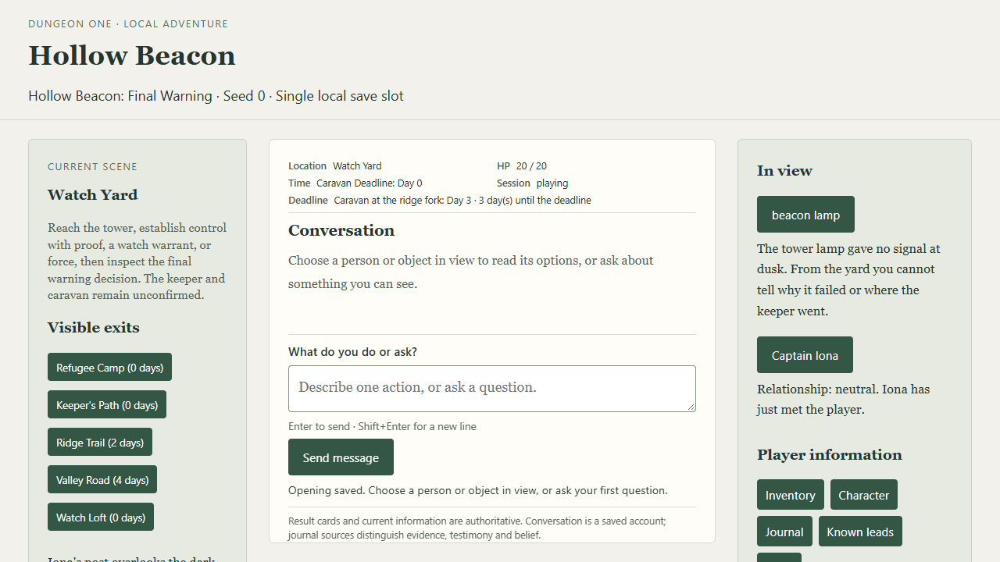

# Issue 92: readable browser journey

The existing conversation and information panels now show a compact persistent
location/HP/day/deadline/session header, defense and attack values, conditions,
visible relationships, carried versus scene versus spent items, and the last
saved action. Engine cards use a distinct system font and background; NPC
dialogue remains attributed. The last-action summary is saved display history,
not an additional source of world facts.

Final Warning v11 browser guidance follows public evidence and milestones,
retains Iona's pending correction, retires provisional ending advice, and closes
open leads on completion. The secured-controls scene and completed final record
replace stale preparation instructions. Released content bytes, digests, engine
projections, saves, traces, and earlier adventures are unchanged. Earlier browser
tuples retain their authored lead policy and gain the shared layout.

## Player check

Prerequisites: Node 24.x, npm, installed dependencies, a desktop browser, a valid
`OPENAI_API_KEY` in the launch environment, and provider network access. These
commands start **Hollow Beacon: Final Warning v11**, seed **0**. Use an empty
disposable slot for the exact route below; an occupied slot continues its saved
adventure and seed instead.

```powershell
Set-Location C:\docs\git\dungeonOne
npm.cmd ci --cache .\.verify-artifacts\npm-cache
npm.cmd run build
npm.cmd run browser -- --seed 0 --save .\.scratch\issue-92-player\slot.json
```

Open the printed `http://127.0.0.1:<available-port>` URL and select **Start
adventure**. Expect Watch Yard, a readable tower objective, 20/20 HP, Day 0,
Day 3 deadline, five exits with costs, and an explanation of how to start a
conversation. Select Captain Iona, read options, then press Escape: focus returns
to Captain Iona. Select her again and **Ask about the beacon and watch leads**.
Expect attributed Iona speech and a saved notice, without a rescue claim.

Open Inventory, Character, Journal, Known leads and Hints. Character shows AC 16,
d20 +5 and 1d8 +3 damage. Journal separates observed evidence, testimony and
beliefs. Close or Escape returns focus to the opener. Request a stronger local
hint: it adds no turn, day, item spend, dice or provider request. Reading earlier
conversation remains in place when a delayed reply arrives.

Type these messages **one at a time in the browser**, waiting for the reply and
enabled message input. Contextual buttons offer equivalent actions.

```text
Ask Captain Iona about the beacon
Travel to Watch Loft
Ask Pell about the last shift
Travel to Signal Records Room
Search beacon setting plate
Take spare signal component
Travel to Watch Loft
Ask Pell about the last shift
Travel to Watch Yard
Travel to Ridge Trail
Brace fallen cart
```

Expect Pell's own account on both visits, observed altered alignment attributed
to the plate, and one carried component. No culprit or keeper fate is inferred.
The ridge arrival is Day 2, Fighter initiative 7 versus raider 3. Brace costs one
action and zero days; the raider rolls 5 and misses against AC 20. Cover then
expires, HP remains 20/20, and the fighter owns the next turn. Character and the
engine card agree. A repeat brace is rejected without another draw.

For continuation, stop the launcher with Ctrl+C **after the complete reply**,
then run exactly:

```powershell
npm.cmd run browser -- --seed 0 --save .\.scratch\issue-92-player\slot.json
```

Open the newly printed URL. Expect automatic continuation with the same combat,
HP, spent cover, day and exact history. Browser mode has no `--resume` flag.

Continue these messages individually on this disposable combat route:

```text
Attack ridge raider
Attack ridge raider
Attack ridge raider
Attack ridge raider
Travel to Ridge Shelter
Recover at dressing station
Travel to Tower Approach
Attack tower sentry
Attack tower sentry
Attack tower sentry
Travel to Beacon Tower
Attack Vey
Attack Vey
Attack Vey
Search unattended signal controls
Travel to Ridge Shelter
Travel to Tower Approach
Travel to Beacon Tower
Fit spare signal component in beacon socket
Search final warning board
```

Expect ridge victory at 14/20 HP, six actual healing to 20/20 with the camp
dressing consumed, sentry victory, then Vey's recorded death with the fighter at
16/20. Returning does not resurrect Vey or restart defeated encounters. Secured
controls update current guidance. Inventory records the fitted component as
spent and not carried. Day remains 2 throughout these local actions.

Select **Ending choices**, read the public stakes, then **Verified safe signal**.
Expect terminal Review mode, disabled composer/actions, no open leads, the
actual casualty, and an unconfirmed keeper/caravan fate. Journal retains a final
record. Reload or stop/relaunch: the final state and exact history return.

For the relationship branch, confirm **New game** in the disposable slot, claim
the familiar signal is safe to Iona, then obtain the plate comparison and return.
Known leads and Hints retain the correction follow-up. Select **Correct the
safe-signal claim with the setting plate**: trust becomes restored, the follow-up
retires without a die, and nobody else's knowledge or the world signal changes.
This branch uses different dice from the combat witness above.

Try an ambiguous request such as `Use it`: expect a question identifying the
missing visible subject without a commit. An unavailable request names the
reason and points back to public options. After a saved action with failed
narration, read its engine result and saved notice; do not repeat the action.

## Evidence and review

`tests/issue-92.test.mjs` adds a real Edge/Playwright browser, HTTP, storage and
replay journey. Typed and clicked routes have identical checkpoints/RNG; the
same route survives command and scripted-AI restart and linked trace replay.
Checks cover source attribution, item ownership, post-commit failure and rejected
retry, combat restart, return visits with a dead actor, local panels/hints,
scroll retention during held narration, final Review and exact reload. A
separate browser relationship branch proves correction guidance and retirement.

A fresh read-only opening reviewer found HP/time and exits below the 1280×720
fold, an ambiguous empty-history notice, and no clear opening instruction. The
layout was revised before the complete player pass. The repeated opening review
confirmed visible status/exits and usable input/contextual actions; automated
bounds also require at least 100px of conversation space and an in-viewport
composer. The specification review also caught a suppressed Iona correction;
that was restored and tested. Standards review's naming finding was corrected.



The Codex desktop browser was operated separately with the checked-in offline
fixture: ordinary-language and contextual Iona exchanges, Pell return visit,
plate search/pickup, all three fights, dressing recovery, process relaunch during
combat, Vey's death and return, component fitting, final stakes and Review Journal.
This is deterministic presentation evidence, not live-model qualification or
#95's unfamiliar-human player acceptance. The fixture maps named messages; it
does not measure general language understanding. No new live provider campaign,
phone usability qualification, startup-policy change (#93), or content release
is claimed.

Focused browser and regression checks passed. `npm.cmd run verify` passed all
seven gates with 668 tests, zero vulnerabilities and zero warnings.
No branch was pushed by this task.
